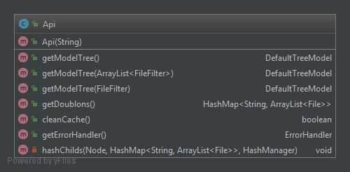
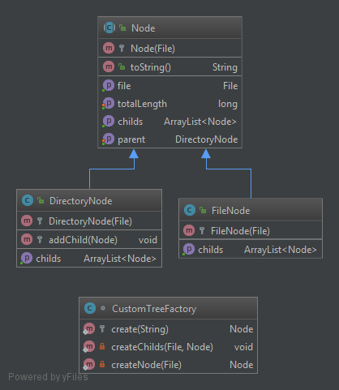
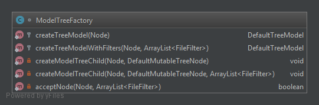
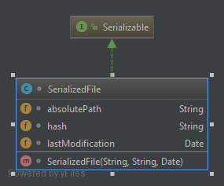
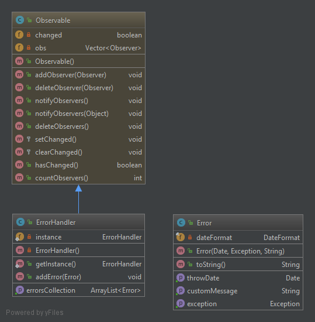

# Il me faut de la place - 1ère Partie
Ce fichier détaillera les choix d'implémentations effectués, et l'architecture du code.
## 1. Les contraintes d'implémentation  
Afin de faciliter l'échange de code, et l'implémentation d'une IHM à partir du code d'un binôme, nous nous sommes mis d'accord sur les principaux services fournis par l'API.  
+ L'API doit être capable de fournir, à partir d'un chemin absolu vers un répertoire, un `TreeModel` représentant l'arborescence de fichiers du répertoire.  
Le `TreeModel` sera ensuite utilisé en `swing`dans l'IHM afin d'afficher l'arborescence.
+ Il doit être possible d'appliquer des filtres sur cette arborescence (par exemple récupérer seulement les fichiers ayant une certaine extension).
+ L'API doit repérer les doublons dans l'arborescence. On appelle doublons des fichiers ayant un contenu identique (même si leurs noms, emplacements, extensions, etc. diffèrent).   
## 2. Les choix d'implémentation 
Ci-dessous la classe `Core.Api`, qui fournit les méthodes utilisables dans l'IHM : 
  
### 2.1. Représentation Objet de l'arborescence de fichiers
Après plusieurs tests de structure d'arborescence, j'ai décidé d'utiliser deux structures distinctes.  
#### 2.1.1 CustomTree
A partir d'un chemin absolue, l'API construit un `CustomTree`.  
Il s'agit d'un arbre implémenté à l'aide du patron composite : il est composé des classes `Core.FileNode` et `Core.DirectoryNode` qui héritent de la classe abstraite `Core.Node`.
  
Cette structure est immutable, et elle servira de référence pour construire les differents `TreeModel`.    
La classe `Core.CustomTreeFactory` s'occupe de la construction récursive de cet arbre.  
J'ai décidé que chaque noeud porte l'instance de `java.io.File` représentant le fichier, et que cette instance soit accessible depuis l'IHM, cela évite de redéfinir innutilement les méthodes déjà implémentées dans la classe `File` (comme la suppression, la modification d'un fichier, etc.).  
La seule méthode que j'ai jugé nécessaire de réimplémentée est la méthode renvoyant la taille d'un fichier : celle de la classe `java.io.File` ne renvoit pas la taille totale dans le cas d'un répertoire. Cette taille est donc calculée pendant la création récursive de l'arbre, et accessible via la méthode `totalLength() : long`. 
#### 2.1.2 TreeModel
Le CustomTree construit est ensuite transformé en `javax.swing.tree.DefaultTreeModel`, un arbre qui servira à l'affichage de l'arborescence dans l'IHM swing.  
Chaque noeud du treeModel porte une instance de `Core.FileNode` ou `Core.DirectoryNode`, ce qui permet de récupérer les informations utiles sur le noeud (taille du fichier/répertoire, méthode de suppression/modification, etc.).  
Le treeModel peut être construit tel quel (même arborescence que le customTree) ou en appliquant des filtres héritants de la classe abstraite `java.io.FileFilter`, sans pour autant reparcourir physiquement le disque dur (l'arborescence est déjà en mémoire via le `CustomTree`).
Cet arbre est construit grâce à la classe `Core.ModelTreeFactory`.
  
### 2.2. L'application de filtres
Pour la gestion des filtres appliqués à l'arborescence, j'ai décidé d'implémenter seulement la méthode de validation des filtres.  
La méthode `getModelTree(FileFilter)` de la classe `Core.Api`, prend en paramètre un `FileFilter` qui est une classe abstraite.  
Le binôme qui développera l'IHM sera donc en mesure d'implémenter cette classe comme bon lui semble. Il me paraissait plus judicieux de ne pas le limiter dans ses choix de filtres.
### 2.3. La recherche de doublons 
Une des fonctionnalités principales de l'API est la recherche de doublons.
#### 2.3.1 Comment détécter les doublons ?
Nous avons réfléchi à plusieurs façons de détecter des doublons. Le seul moyen de réperer les doublons de façon sûr est de comparer les hashs des différents fichiers.  
C'est une méthode longue car elle nécessite de lire l'intégralité des fichiers pour calculer leur hash.  
Pour cela, j'ai utilisé l'algorithme MD5, fourni nativement dans la biliothèque `java.security`. Cet algorithme est considéré comme dépassé et impropre à une utilisation en sécurité (ce qui nous importe peu dans notre cas), mais a l'avantage d'être "rapide" par rapport aux autres.   
#### 2.3.2 Comment optimiser la recherche des doublons ?
Afin d'améliorer les performances de recherche de doublons, j'ai implémenté une méthode de sauvegarde des hash calculés, il s'agit du cache.  
Celui-ci permet de sauvegarder tous les hash de fichiers effectués, afin de ne pas les recalculer lorsque le fichier en question est resté inchangé.  
Le cache est composé d'une liste d'objets `Core.SerializedFile`, qui est sérialisée dans un fichier `hash_cache.ser`.    
La classe `Core.SerializedFile` représente un fichier et son hash en cache et porte les informations suivantes :
+ `absolutePath` : chemin absolu du fichier 
+ `hash` : le hash MD5 du fichier
+ `lastModification` : la date de dernière modification  
    

Ainsi, grâce à ces attributs, lors de la recherche de doublons, on peut récupérer le fichier en cache grâce à `absolutePath`, vérifier que celui-ci n'a pas été modifié avec `lastModification` et donc récupérer le hash en cache sans le recalculer.    
Si le fichier n'est pas trouvé dans le cache, ou qu'il a été modifié depuis sa dernière mise en cache, le hash est (re-)calculé, et ajouté ou mis-à-jour dans le cache. 
Tel quel, la taille du cache ne peut qu'augmenter, et pour des grosses arborescences de fichiers la taille du cache peut devenir conséquente.  
*Remarque : ici la taille des fichiers importe peu, c'est leur nombre qui défini la taille du cache*  
J'ai donc ajouté une méthode dans l'API (`cleanCache()`), qui permet de nettoyer le cache. Le cache est parcouru, et on vérifie que pour chaque entrée, le fichier existe encore dans le disque dur afin de l'enlever du cache si ce n'est pas le cas.        

**Performances observées :**  
*Test effectué sur une arborescence de 299Mo, contenant 8 112 fichiers* 
```
1er calcul de doublons (cache inexistant) : 11 578ms
2e calcul de doublons (avec cache) : 1 213 ms
```
 
### 2.4. Gestion des erreurs  
Lors du scan d'un disque dur, beaucoup de fichiers sont innaccessibles en lecture (fichiers système, fichiers déjà utilisés et donc verrouillés par un autre programme, etc.), et donc provoquent des erreurs.  
J'ai donc implémenter un gestionnaire d'exceptions : `Core.ErrorHandler`. Celui-ci permet de stocker des exceptions ou erreurs survenues (représentées par la classe `Error`), afin de les aficher plus tard dans l'IHM, ou dans un fichier de log.
La classe `ErrorHandler` est un Singleton, ce qui permet de récupérer son unique instance n'importe où dans le programme.  
Elle hérite également de la classe abstraite `java.util.Observable`, et notifie ses observateurs dès qu'une erreur est ajoutée. Cela peut permettre à l'IHM d'afficher instantanément les nouvelles erreurs.  
      

## 3. Difficultés rencontrées
Les principales difficultés que j'ai recontrée étaient autour de l'optimisation des traitements.  
Il s'agit de traitements assez long (parcours d'arborescence, calcul de hash), et il a fallut trouver, ou du moins essayer de trouver les méthodes les plus rapides.  
Par exemple, lors de l'implémentation du cache, j'ai d'abord pensé à sauvegarder le cache sous format XML. Seulement, lorsque la taille du cache augmentait, requeter dedans devenait vite très long, à tel point qu'il était parfois plus rapide d'hacher à nouveau le fichier.  
J'ai donc imaginé un autre moyen : à l'aide de la serialisation java et des requêtes dans une liste d'objets qui sont plus rapides.  
  
## 4. Améliorations
J'ai pensé (trop tard) à un algorithme de calcul de doublons plus performant que l'actuel. Mais j'ai manqué de temps pour l'implémenter. Je vais donc essayer le décrire ici :  
Il faudrait hacher seulement un petit nombre d'octets au début et à la fin de chaque fichier, puis ne garder que les "pseudo-doublons" sur les octets hachés.  
Ensuite, on hache une partie un peu plus grande de ces "pseudo-doublons", pour éliminer les "faux-doulons".  
On effectue cela autant de fois qu'il faut pour hacher entièrement les fichiers restants.   
Cela permettrait de détecter les doubons de manière sûr, sans pour autant avoir à hacher l'intégralité des fichiers.  
Cet algorithme présente quelques difficultés (par exemple, tous les fichiers sont de tailles différentes, il faut donc trouver un moyen de comparer des séquences d'octets de même taille sur des fichiers différents), et je n'ai pas vraiment étudié sa complexité mais je pense qu'il doit être plus rapide. 


